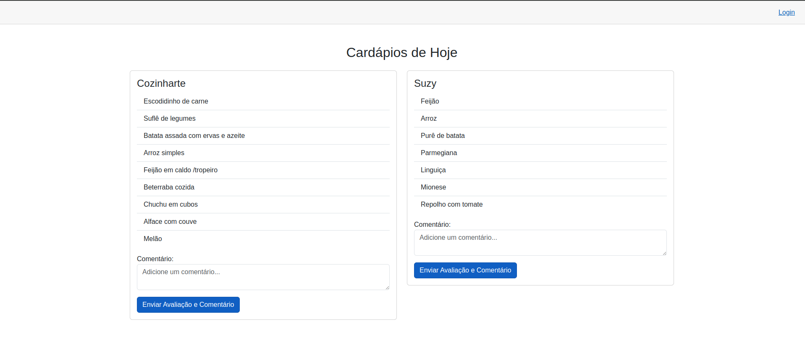
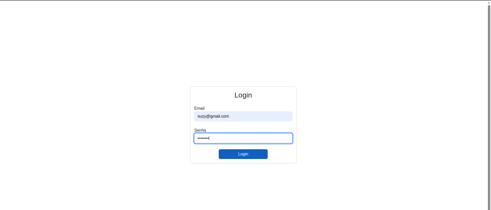
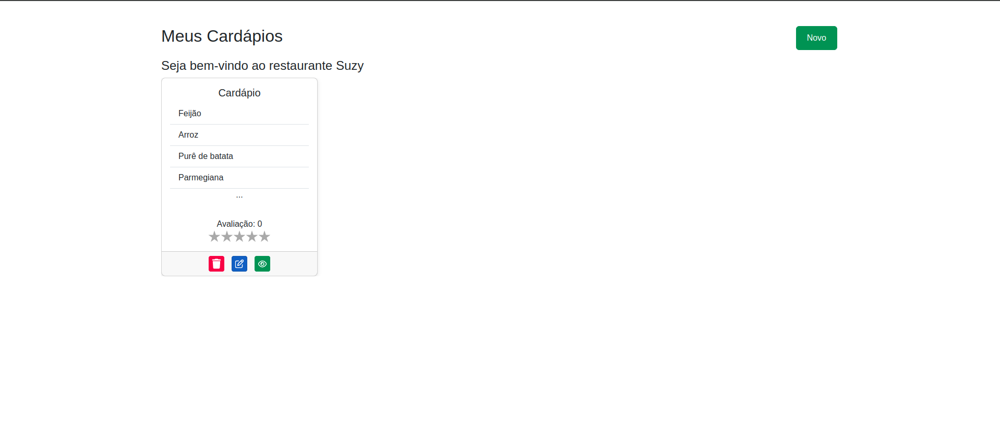
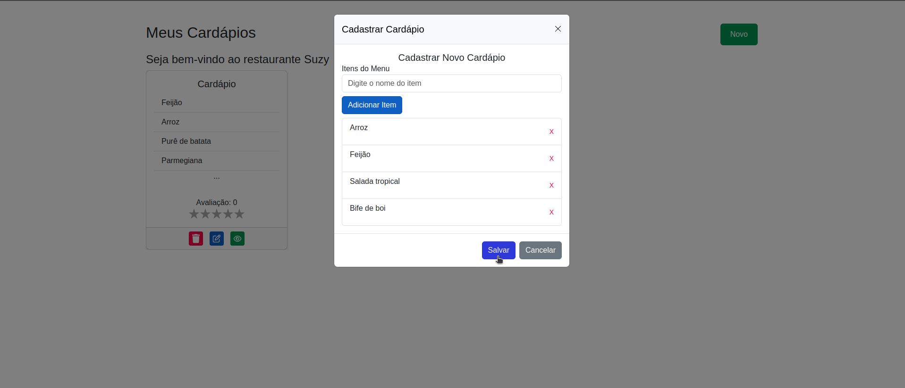

[Leia esta página em português](README.md)

# Neighborhood Flavors .NET 🍽️


**Neighborhood Flavors .NET** is a web application developed as part of an academic discipline, using ASP.NET MVC technologies for managing restaurants in the vicinity of our educational institution (IFNMG - Montes Claros).
It allows the registration, viewing and evaluation of establishments, encouraging the promotion of neighborhood gastronomy.

## 🚀 Technologies Used
- .NET 8.0
- ASP.NET MVC
- Entity Framework Core
- SQL Server


## ⚙️ How to Run
Prerequisites:
- .NET SDK installed
- SQLite (for local database)

Step by step:
   ```bash
   # Clone this repository
   $ git clone https://github.com/gabrielsizilio/neighborhood-flavors.git

   # Go into the repository
   $ cd neighborhood-flavors

   # Install/Restore dependencies
   $ dotnet restore

   # Run the app
   $ dotnet watch run
   ```

## 🎯 Features
The features are very simple, for learning purposes.

- View restaurants and menus
- Rating establishments
- Comment system

## 📷 Screenshots





## Contributors 😎

|  |  |  |
|:---:|:---:|:---:|
| [@gabrielsizilio](https://github.com/gabrielsizilio) | [@yodemisj](https://github.com/yodemisj) | [@FilipeAbner](https://github.com/FilipeAbner) |
